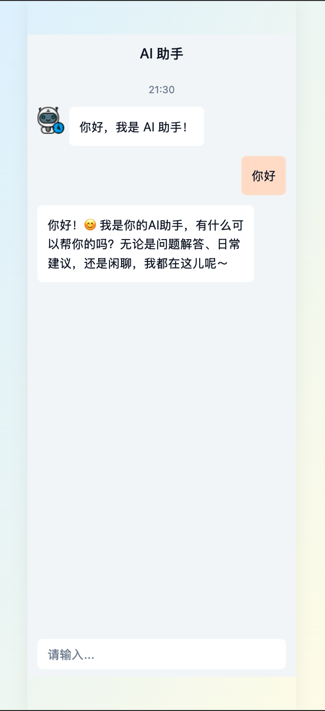
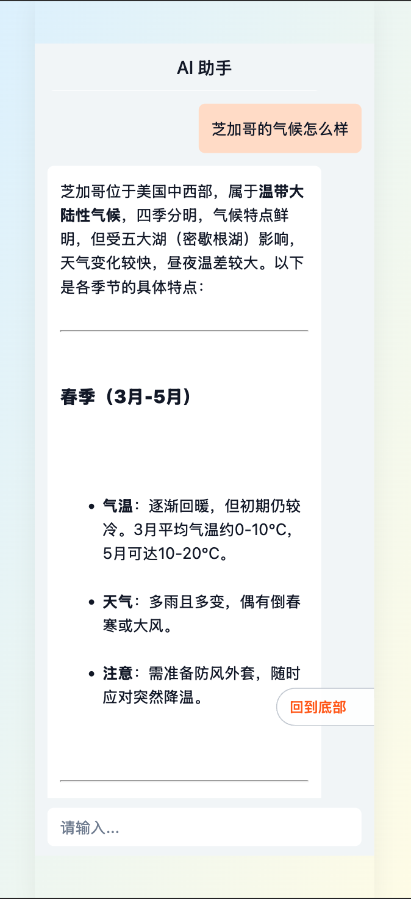

# AI Chat Assistant (React + TypeScript + Vite)

A clean and responsive AI chat interface built with **React**, **TypeScript**, and **Vite**, integrating DeepSeek API and styled using [ChatUI](https://chatui.io/) component system.

## ✅ Features

- 🤖 **Conversational AI** – Integrated with [DeepSeek API](https://platform.deepseek.com)
- ⌨️ **Typing Indicator** – Shows assistant is responding in real-time
- 📝 **Markdown Support** – Renders formatted replies (bold, links, code blocks, etc.)
- 💬 **Chat UI Components** – Built with customizable bubble and typing components

## 🧰 Tech Stack

- React 18 + TypeScript
- Vite for fast development
- DeepSeek API
- marked + DOMPurify for Markdown parsing & sanitization
- Custom or library-based Chat UI components

## 📦 Installation

```bash
npm install
```

## 🚀 Run Dev Server

```bash
npm run dev
```

## 🌐 Environment Variables

Create a `.env` file in your root directory:

```env
VITE_DEEPSEEK_API_KEY=your_deepseek_api_key_here
```

You can obtain your API key from the [DeepSeek API Console](https://platform.deepseek.com/usage) and vie the full API documentation [here](https://api-docs.deepseek.com/)

## 🛡 Security

- All HTML content is sanitized using DOMPurify
- API keys are stored securely via `.env` and never exposed in code

## 📸 Preview

Example chat conversations:

### 💬 Plain Text Message



### 📝 Markdown Rendering



main 分支的改动

## 📄 License

MIT License
